<div align="center">

# 🌟 **Vo Van Viet** 🌟
### 🚀 *Full Stack Developer | AI Enthusiast *


<br/>

```ascii
╔══════════════════════════════════════════════════════════════════╗
║  "Turning innovative ideas into scalable digital solutions"      ║
╚══════════════════════════════════════════════════════════════════╝
```

[](https://github.com/vietvo371) 
[](https://www.linkedin.com/in/vo-van-viet-3b54a5266)
[](https://vietvo371.github.io/Portfolio/)
[](mailto:vietvo371@gmail.com)


</div>

---

## 🎓 **About Me**

<table>
<tr>
<td width="50%">

### 🏆 **Achievements**
- 🥇 **Highest Score Winner** - Graduation Thesis Competition (June 2025)
- 🎓 **Software Engineering Graduate** - Duy Tan University
- 🌟 **AI & Full Stack Specialist**

### 🎯 **Current Focus**
- 🤖 **AI-Powered Applications**
- 🎬 **Streaming Platform Development**
- ☁️ **Cloud-Native Architecture**

</td>
<td width="50%">

### 🔥 **Quick Facts**
```yaml
name: "Vo Van Viet"
role: "Full Stack Developer"
education: "Duy Tan University"
specialization: ["AI Integration", "Web Development"]
passion: "Building scalable solutions"
motto: "Code with purpose, innovate with impact"
```

</td>
</tr>
</table>

---

## 🛠️ **Technology Arsenal**

<div align="center">

### **Frontend Mastery**


### **Backend Excellence**


### **Database Management**


### **DevOps & Tools**


### **Game Development**


</div>

---

## 🏆 **Featured Projects**

<div align="center">

### 🎬 **Multi-Platform Paid Movie Streaming System & AI Content Recommendation**
**🥇 Highest Score Winner - Graduation Thesis Competition (June 2025)**

<a href="https://github.com/Khoa-CNTT/XDHTXPDN7168">
  
</a>

</div>

<table>
<tr>
<td width="50%">

#### 🌟 **Key Features**
- 🎥 **Multi-Platform Streaming** - Web, Mobile, Smart TV
- 🤖 **AI-Powered Recommendations** - Personalized content discovery
- 💳 **Secure Payment Integration** - MB Bank payment gateway
- 🔐 **Advanced Security** - User authentication & authorization
- 📊 **Analytics Dashboard** - Real-time viewing statistics

</td>
<td width="50%">

#### 🛠️ **Tech Stack**
- **Frontend**: Vue.js, Responsive Design
- **Backend**: Laravel, RESTful APIs
- **Database**: MySQL, Optimized Queries
- **AI/ML**: Content Recommendation Engine
- **Payment**: MB Bank Integration
- **Deployment**: Docker, Cloud Infrastructure

</td>
</tr>
</table>

---

<div align="center">

### 🚨 **RELIEFLINK - Disaster Response System**
**Open Source Software Competition 2024**

</div>

<table>
<tr>
<td width="50%">

#### 🎯 **Mission**
Emergency response coordination platform designed to save lives and optimize disaster relief efforts.

#### 🔧 **Technologies**
- **Interface**: Appsmith (Customizable)
- **Backend**: Node.js, Socket.io
- **Database**: MongoDB (Real-time)
- **Maps**: OpenStreetMap Integration
- **Deployment**: Docker Containers

</td>
<td width="50%">

#### ⚡ **Features**
- 🗺️ **Real-time Resource Tracking**
- 📡 **Live Communication System**
- 🚁 **Emergency Response Coordination**
- 📊 **Data Analytics Dashboard**
- 🔄 **Scalable Microservices Architecture**

</td>
</tr>
</table>

---

## 🎮 **Game Development Expertise**

<div align="center">

### **2D Unity Game Development**

</div>

<table>
<tr>
<td width="33%">

#### 🎨 **Game Design**
- Level Design & Architecture
- Gameplay Mechanics
- User Experience Optimization

</td>
<td width="33%">

#### 💻 **Technical Skills**
- C# Scripting & Logic
- Event Management Systems
- Performance Optimization

</td>
<td width="33%">

#### 🚀 **Specializations**
- 2D Physics Implementation
- Animation Systems
- Cross-Platform Deployment

</td>
</tr>
</table>

---

## 📊 **GitHub Analytics**

<div align="center">


### **🔥 GitHub Streak**


</div>

---

## 🌟 **What's Next?**

```mermaid
graph LR
    A[🤖 AI Integration] --> B[☁️ Cloud Architecture]
    B --> C[🌍 Open Source]
    C --> D[🚀 Innovation]
    D --> A
```

<div align="center">



</div>

- 🌐 **Cloud-Native Applications** - Microservices & Serverless
- 🤝 **Open Source Contributions** - Community-driven development
- 🧠 **AI/ML Research** - Next-generation recommendation systems
- 🎓 **Knowledge Sharing** - Mentoring & Technical Writing

---

## 📬 **Let's Connect!**

<div align="center">

<table>
<tr>
<td align="center">
<a href="mailto:vietvo371@gmail.com">

</a>
</td>
<td align="center">
<a href="https://vietvo371.github.io/Portfolio">

</a>
</td>
<td align="center">
<a href="https://www.linkedin.com/in/vo-van-viet-3b54a5266">

</a>
</td>
<td align="center">
<a href="https://github.com/vietvo371">

</a>
</td>
</tr>
</table>

### **💬 Open for collaboration on:**
- 🎬 Streaming platform innovations
- 🤖 AI-powered applications  
- 🌐 Full-stack web development
- 🎮 Game development projects

</div>

---

<div align="center">

### 🎯 **"Innovation through code, impact through collaboration"**


⭐️ **Thank you for visiting my profile!** ⭐️  
**[Vo Van Viet](https://github.com/vietvo371) | Building the future, one commit at a time**

</div>
